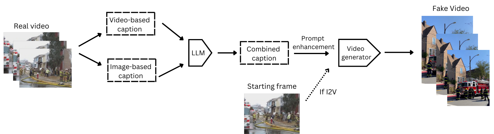

# DecepTIV: Learning to Detect T2V and I2V Videos


Official code of: DecepTIV: Learning to Detect T2V and I2V Videos


## Download the videos from DecepTIV dataset

- Download the dataset from [huggingface](https://huggingface.co/datasets/sotossta/DecepTIV) and place it in `./Dataset/`. The videos from the dataset take around 61GB of memory.
- The `./Dataset/`. folder should contain 11 subfolders corresponding to different T2V or I2V generators and 1 subfolder for the Real videos.

```
Every subfolder corresponding to a generator or Real videos has the following
structure. For example for HunyuanVideo:

📦HunyuanVideo
 ┣ 📂Firefighter
 ┃ ┣ 📂splits
 ┃ ┣ 📂videos
 ┃ ┗ 📂videos_pert
 ┣ 📂Soldier
 ┃ ┣ 📂splits
 ┃ ┣ 📂videos
 ┃ ┗ 📂videos_pert
 ┗ 📂Weather
 ┃ ┣ 📂splits
 ┃ ┣ 📂videos
 ┃ ┗ 📂videos_pert

The method subfolder contains three more subfolders corresponding to the category
of videos (Firefighter, Soldier and Weather). Then each of these subfolders contains
folders containing the splits, videos and perturbed videos.
 ```

## Extract video frames

To extract a specific number of frames from a given T2V or I2V method (e.g. HunyuanVideo) run the following from the base directory:

```bash
python extract_frames.py \
--base_dir /sotossta/DecepTIV/Dataset \
--category all \
--dataset HunyuanVideo \
--max_frames 50 \
--perturbed 0
```

You can extract the frames from all methods by changing the `dataset` argument to `all`. Extracting the frames from videos will create another subfolder called `/images` (or `/images_pert` for the perturbed videos).

```
The HunyuanVideo directory should now have the following form

📦HunyuanVideo
 ┣ 📂Firefighter
 ┃ ┣ 📂images
 ┃ ┣ 📂images_pert
 ┃ ┣ 📂splits
 ┃ ┣ 📂videos
 ┃ ┗ 📂videos_pert
 ┣ 📂Soldier
 ┃ ┣ 📂images
 ┃ ┣ 📂images_pert
 ┃ ┣ 📂splits
 ┃ ┣ 📂videos
 ┃ ┗ 📂videos_pert
 ┗ 📂Weather
 ┃ ┣ 📂images
 ┃ ┣ 📂images_pert
 ┃ ┣ 📂splits
 ┃ ┣ 📂videos
 ┃ ┗ 📂videos_pert
 ```

## Download detector weights for inference

- All the detector weights can be download from  [google drive](https://drive.google.com/drive/folders/1Zu80bu4cQdLtKs1znEnMcd9VuoauaNmN?usp=sharing) and must be placed in `/sotossta/DecepTIV/classification/ckpts`
- Every detector folder has 7 subfolders corresponding to the generation method that the detector has been trained on (all folder means that the detector was trained on all 6 generators)
- Further subfolders indicate what categories of videos the detector was trained on. For example: `/FTCN/all/Firefighter/` corresponds to FTCN trained on videos from all generators and from category firefighter, `/FTCN/all/all/`, corresponds to FTCN trained on videos from all generators and from all categories
- Pretrained backbones can be download from:  [Xception](https://github.com/Debanik/FaceForensics/blob/master/classification/xception-b5690688.pth) and [ViT](https://openaipublic.azureedge.net/clip/models/5806e77cd80f8b59890b7e101eabd078d9fb84e6937f9e85e4ecb61988df416f/ViT-B-16.pt). These must be placed in `/sotossta/DecepTIV/classification/pretrained`

## Training and testing detectors

### Environment setup
All of our experiments where done using Python version 3.11, so we recommend
that version.


```bash
# move to classification directory from base dir
cd classification

# create and activate environment
python -m venv env
source env/bin/activate

# install requirements
pip install -r requirements.txt
```

### Training

To train an F3Net detector on all generators and all video categories run:
```bash
python train.py \
        --base_dir /sotossta/DecepTIV \
        --dataset all \
        --category all \
        --detector_config /sotossta/DecepTIV/classification/configs/detectors/f3net.yaml \
        --frames_sampled_real 48 \
        --balanced 1 \
```
Training on different datasets and categories can be achieved by altering the `dataset` and `category` arguments. Also to train different detectors change the path of `detector_config` to the configuration file of another detector.

### Testing

As our experiments involve testing a lot of versions of the same detector, we recommend the use of the provided shell script for testing:

```bash
sh test.sh
```
The shell script contains the following variables that can be altered:

1. `trained_on`: the generator that our given detector was trained on e.g. `all`, `HunyuanVideo`, etc
2. `trained_category`: the category of videos that the detector was trained on e.g. `Firefighter`, `Soldier`, etc
3. `test_dataset`: choose testing videos from a specific generator e.g. `all`, `Gen3`, etc
4. `test_category`: choose category of testing videos
5. `perturbed`: choose to test on perturbed videos or not
6. `weights`: name of the model checkpoint e.g. `model_epoch4_val0.9977.tar`

Note the similar to the training section, different detectors for testing can be chosen by altering `detector_config`.

# Generating fake videos



Below we show how to generate fake videos from the generators [CogVideo](https://github.com/THUDM/CogVideo), [SVD](https://github.com/Stability-AI/generative-models) and [Wan2.1](https://github.com/Wan-Video/Wan2.1), through their [diffusers](https://huggingface.co/docs/diffusers/index) implementation. We also implement the API based generators [Gen3](https://runwayml.com/research/introducing-gen-3-alpha/) and [Luma](https://lumalabs.ai/dream-machine). For the remaining generators we point the reader to the official repositories:

[Open-Sora](https://github.com/hpcaitech/Open-Sora)

[EasyAnimate](https://github.com/aigc-apps/EasyAnimate)

[DynamiCrafter](https://github.com/Doubiiu/DynamiCrafter)

### Environment setup

```bash
# move to fake video generation directory from base dir
cd generate_fake_videos

# create and activate environment
python -m venv env
source env/bin/activate

# install requirements
pip install -r requirements_gen.txt
```

### Inference

To generate fake videos from CogVideo of category firefighter, run:

```bash
python inference.py \
    --data_dir /sotossta/DecepTIV/Dataset \
    --category Firefighter \
    --prompt_file /sotossta/DecepTIV/generate_fake_videos/prompts/Firefighter.json \
    --generator_config /sotossta/DecepTIV/generate_fake_videos/configs/CogVideo.yaml
```

- To generate fake videos of a different category, both `category` and `prompt_file` need to be changed to the file containing the prompts extracted from the specific category
- To use a different generator change `generator_config` to the configuration file of another model
- Note that the configuration files contain various parameters related to every model. Some parameters to note are:
     
     - `cpu_offload`: setting this to `True` decreases VRAM usage but slows inference down
     - `inference_steps`: diffusion steps for video generation (generally the more the better)
     - `prompt_enhancement`: set this to `False` if prompt enhancement is not needed. Note that to use prompt enhancement an  [openai API key](https://openai.com/api/) has to be generated and saved as `/sotossta/DecepTIV/generate_fake_videos/keys/API_KEY_OPENAI`

- Note that to generate videos from the API based models, API keys from [Gen3](https://dev.runwayml.com/) and [Luma](https://lumalabs.ai/api) must be generated and saved as `/sotossta/DecepTIV/generate_fake_videos/keys/API_KEY_GEN3` and `/sotossta/DecepTIV/generate_fake_videos/keys/API_KEY_LUMA`
---

## License

This dataset is licensed under the [CC BY-NC 4.0](https://creativecommons.org/licenses/by-nc/4.0/) license.
