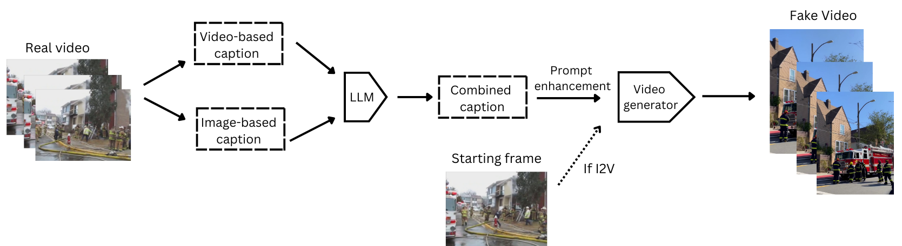

# DecepTIV: A Large-Scale Benchmark for Robust Detection of T2V and I2V Synthetic Videos

Official code of: *DecepTIV: A Large-Scale Benchmark for Robust Detection of T2V and I2V Synthetic Videos*

---

## Table of Contents

1. [Dataset](#dataset)
2. [Extract Video Frames](#extract-video-frames)
3. [Detector Weights & Pretrained Backbones](#detector-weights--pretrained-backbones)
4. [Training Detectors](#training-detectors)
5. [Testing Detectors](#testing-detectors)
6. [Generating Fake Videos](#generating-fake-videos)

---

## Dataset

Download the dataset from [HuggingFace](https://huggingface.co/datasets/sotossta/DecepTIV) and place it under `./Dataset/`. The full dataset is approximately 90 GB.

The `./Dataset/` folder contains subfolders for each generator and one for real videos:

| Generator | Type | Split |
|-----------|------|-------|
| Real | — | train / val / test |
| HunyuanVideo | T2V | train / val / test |
| Open-Sora | T2V | train / val / test |
| EasyAnimate_T2V | T2V | train / val / test |
| EasyAnimate_I2V | I2V | train / val / test |
| DynamiCrafter | I2V | train / val / test |
| SVD | I2V | train / val / test |
| CogVideo_T2V | T2V | test only |
| CogVideo_I2V | I2V | test only |
| Wan2.1 | T2V | test only |
| Luma | I2V | test only |
| Gen3 | T2V | test only |
| Veo3-T2V | T2V | test only |
| Veo3-I2V | I2V | test only |
| Sora2-T2V | T2V | test only |
| Sora2-I2V | I2V | test only |

Each generator subfolder has the following structure (example for HunyuanVideo):

```
📦HunyuanVideo
 ┣ 📂Firefighter
 ┃ ┣ 📂splits          ← train.txt / val.txt / test.txt
 ┃ ┣ 📂videos
 ┃ ┗ 📂videos_pert     ← pre-computed perturbed videos
 ┣ 📂Soldier
 ┃ ┣ 📂splits
 ┃ ┣ 📂videos
 ┃ ┗ 📂videos_pert
 ┗ 📂Weather
   ┣ 📂splits
   ┣ 📂videos
   ┗ 📂videos_pert
```

Videos cover three semantic categories: **Firefighter**, **Soldier**, and **Weather**.

---

## Extract Video Frames

Before training or testing, extract frames from videos using `extract_frames.py` (run from the project root).

**Extract frames for a single generator:**
```bash
python extract_frames.py \
    --base_dir /path/to/DecepTIV/Dataset \
    --dataset HunyuanVideo \
    --category all \
    --max_frames 50 \
    --perturbed 0
```

**Extract frames for all generators:**
```bash
python extract_frames.py \
    --base_dir /path/to/DecepTIV/Dataset \
    --dataset all \
    --category all \
    --max_frames 50
```

**Extract frames only for the test split:**
```bash
python extract_frames.py \
    --base_dir /path/to/DecepTIV/Dataset \
    --dataset HunyuanVideo \
    --category all \
    --max_frames 50 \
    --test_only
```

**Extract frames from perturbed videos:**
```bash
python extract_frames.py \
    --base_dir /path/to/DecepTIV/Dataset \
    --dataset all \
    --category all \
    --max_frames 50 \
    --perturbed 1
```

After extraction, an `images/` folder (or `images_pert/` for perturbed) is created inside each category subfolder:

```
📦HunyuanVideo
 ┣ 📂Firefighter
 ┃ ┣ 📂images          ← extracted frames (one subfolder per video)
 ┃ ┣ 📂images_pert
 ┃ ┣ 📂splits
 ┃ ┣ 📂videos
 ┃ ┗ 📂videos_pert
 ...
```

**Arguments:**

| Argument | Default | Description |
|----------|---------|-------------|
| `--base_dir` | `/sotossta/DecepTIV/Dataset` | Path to the Dataset folder |
| `--dataset` | required | Generator name or `all` |
| `--category` | `Firefighter` | `Firefighter`, `Soldier`, `Weather`, or `all` |
| `--max_frames` | `50` | Maximum frames extracted per video |
| `--perturbed` | `0` | `1` to extract from `videos_pert/`, `0` for `videos/` |
| `--test_only` | flag | If set, only processes videos listed in `test.txt` |

---

## Detector Weights & Pretrained Backbones

**Pretrained backbones** must be placed in `classification/pretrained/`:

- [Xception](https://github.com/Debanik/FaceForensics/blob/master/classification/xception-b5690688.pth) → `classification/pretrained/xception-b5690688.pth` (required for F3Net, Xception, SPSL)
- [ViT-B/16](https://openaipublic.azureedge.net/clip/models/5806e77cd80f8b59890b7e101eabd078d9fb84e6937f9e85e4ecb61988df416f/ViT-B-16.pt) → `classification/pretrained/ViT-B-16.pt` (required for CLIP-based detectors)

**Trained detector checkpoints** can be downloaded from [Google Drive](https://drive.google.com/drive/folders/1Zu80bu4cQdLtKs1znEnMcd9VuoauaNmN?usp=sharing) and must be placed in `classification/ckpts/`. Each detector folder contains subfolders organised as `<trained_dataset>/<trained_category>/`, for example:

```
classification/ckpts/
└── FTCN/
    ├── all/
    │   ├── Firefighter/   ← trained on all generators, Firefighter category
    │   └── all/           ← trained on all generators, all categories
    └── HunyuanVideo/
        └── Firefighter/
```

---

## Training Detectors

### Environment setup

```bash
cd classification
python -m venv env
source env/bin/activate
pip install -r requirements.txt
```

The code requires Python 3.10 and a PyTorch build that matches your CUDA driver. To install PyTorch for CUDA 12.1:
```bash
pip install torch torchvision --index-url https://download.pytorch.org/whl/cu121 --force-reinstall
```

### Available detectors

Each detector has a YAML config in `classification/configs/`:

| Config file | Detector | Backbone type | Input |
|-------------|----------|---------------|-------|
| `efficientnetb4.yaml` | EfficientNet-B4 | CNN | Single frame |
| `xception.yaml` | Xception | CNN | Single frame |
| `mesoinception4.yaml` | MesoInception4 | CNN | Single frame |
| `f3net.yaml` | F3Net | CNN + frequency | Single frame |
| `spsl.yaml` | SPSL | Xception + phase spectrum | Single frame |
| `swint.yaml` | SwinT | Swin Transformer | Single frame |
| `tallswin.yaml` | TallSwin | Swin Transformer | Video clip |
| `clip_VPT.yaml` | TuneTIV | CLIP ViT-B/16 + visual prompts | Single frame |
| `universal_FD.yaml` | Universal-FD | CLIP ViT-B/16 (frozen) | Single frame |
| `ftcn.yaml` | FTCN | CLIP + Temporal Transformer | Video clip |
| `demamba.yaml` | DeMamba | CLIP + Mamba | Video clip |
| `unite.yaml` | UNITE | CLIP + Video Transformer | Video clip |

Video-clip detectors (TallSwin, FTCN, DeMamba, UNITE) sample `clip_size` consecutive frames per clip (default 8).

### Running training

```bash
cd classification

python train.py \
    --base_dir /path/to/DecepTIV \
    --dataset all \
    --category all \
    --detector_config /path/to/DecepTIV/classification/configs/efficientnetb4.yaml \
    --frames_sampled_real 1 \
    --balanced 1
```

**Arguments:**

| Argument | Default | Description |
|----------|---------|-------------|
| `--base_dir` | `/sotossta/DecepTIV` | Project root (Dataset folder must be inside) |
| `--dataset` | required | `HunyuanVideo`, `Open-Sora`, `EasyAnimate_T2V`, `EasyAnimate_I2V`, `DynamiCrafter`, `SVD`, or `all` |
| `--category` | `Firefighter` | `Firefighter`, `Soldier`, `Weather`, or `all` |
| `--detector_config` | — | Path to detector YAML config |
| `--frames_sampled_real` | `1` | Frames sampled per real video per epoch |
| `--balanced` | `1` | `1` to balance real/fake frame counts; `0` to use equal sampling |

Checkpoints are saved to `classification/ckpts/<ModelName>/<dataset>/<category>/` and only the best validation-AUC model is kept per run.

---

## Testing Detectors

### Standard testing

The recommended way to run testing is via the provided shell script, which you can edit to set your experiment variables:

```bash
cd classification
# Edit test.sh to set trained_on, trained_category, test_dataset, test_category, perturbed, weights
sh test.sh
```

Or run directly:

```bash
cd classification

python test.py \
    --base_dir /path/to/DecepTIV \
    --dataset all \
    --category all \
    --detector_config /path/to/DecepTIV/classification/configs/efficientnetb4.yaml \
    --ckpt_dir all/all \
    --ckpt_weights model_epoch8_val0.9995.tar
```

`--ckpt_dir` should be the path relative to `classification/ckpts/<ModelName>/`, e.g. `all/Firefighter`.

### Testing on perturbed videos

Pre-extracted perturbed frames (from `images_pert/`) can be tested with:

```bash
python test.py \
    --base_dir /path/to/DecepTIV \
    --dataset all \
    --category all \
    --perturbed 1 \
    --detector_config /path/to/DecepTIV/classification/configs/efficientnetb4.yaml \
    --ckpt_dir all/all \
    --ckpt_weights model_epoch8_val0.9995.tar
```

### Cross-dataset testing

Test a trained detector on external benchmarks using `--cross_dataset`:

```bash
python test.py \
    --base_dir /path/to/benchmark \
    --dataset all \
    --category all \
    --cross_dataset GenVideo \
    --detector_config /path/to/DecepTIV/classification/configs/efficientnetb4.yaml \
    --ckpt_dir all/all \
    --ckpt_weights model_epoch8_val0.9995.tar
```

| `--cross_dataset` value | Benchmark | Generators included |
|------------------------|-----------|---------------------|
| `GenVideo` | GenVideo | MorphStudio, Gen2, HotShot, Lavie, Show_1, MoonValley, Crafter, ModelScope, WildScrape |
| `Vahdati` | Vahdati et al. | CogVideo, Luma, Pika, SVD, VideoCrafter, VideoCrafter_v2 |
| `GenVidBench` | GenVidBench | Pika, VideoCrafter2, Modelscope, T2V-Zero, MuseV, SVD, CogVideo, Mora |

### Testing arguments

| Argument | Default | Description |
|----------|---------|-------------|
| `--base_dir` | `/sotossta/DecepTIV` | Project root |
| `--dataset` | required | Generator name or `all` |
| `--category` | `Firefighter` | `Firefighter`, `Soldier`, `Weather`, or `all` |
| `--perturbed` | `0` | `1` to test on pre-extracted perturbed frames |
| `--frames_sampled` | `1` | Frames sampled per video during inference |
| `--detector_config` | — | Path to detector YAML config |
| `--ckpt_dir` | required | Relative checkpoint directory, e.g. `all/Firefighter` |
| `--ckpt_weights` | required | Checkpoint filename, e.g. `model_epoch4_val0.9977.tar` |
| `--cross_dataset` | `None` | External benchmark: `GenVideo`, `Vahdati`, or `GenVidBench` |

### Results format

Results are saved to `classification/results/<ModelName>/normal/` (or `.../pert/` for perturbed). Each run produces:

- `<dataset>_<category>_results.csv` — per-generator metrics (AUC-ROC, AP, Accuracy, F1, EER, Precision, per-class accuracy) with mean rows appended
- `predictions/<ckpt>_<generator>.csv` — raw per-video predicted probabilities and true labels

---

## Generating Fake Videos



Five generators are directly supported via `generate_fake_videos/inference.py`, using their [Diffusers](https://huggingface.co/docs/diffusers/index) implementation or their public APIs:

| Config | Generator | Mode | Implementation |
|--------|-----------|------|----------------|
| `CogVideo.yaml` | CogVideo | T2V | Diffusers |
| `SVD.yaml` | Stable Video Diffusion | I2V | Diffusers |
| `Wan.yaml` | Wan2.1 | T2V + I2V | Diffusers |
| `Gen3.yaml` | Gen3 (RunwayML) | T2V | API |
| `Luma.yaml` | Luma Dream Machine | I2V | API |

For the remaining generators, refer to their official repositories and webpages:

- [Open-Sora](https://github.com/hpcaitech/Open-Sora)
- [EasyAnimate](https://github.com/aigc-apps/EasyAnimate)
- [DynamiCrafter](https://github.com/Doubiiu/DynamiCrafter)
- [HunyuanVideo](https://github.com/Tencent/HunyuanVideo)
- [Sora2](https://developers.openai.com/api/docs/models/sora-2)
- [Veo3](https://ai.google.dev/gemini-api/docs/video?example=dialogue)

### Environment setup

```bash
cd generate_fake_videos
python -m venv env
source env/bin/activate
pip install -r requirements_gen.txt
```

### Inference

To generate videos for the Firefighter category using CogVideo (T2V):

```bash
python inference.py \
    --data_dir /path/to/DecepTIV/Dataset \
    --category Firefighter \
    --prompt_file /path/to/DecepTIV/generate_fake_videos/prompts/Firefighter.json \
    --generator_config /path/to/DecepTIV/generate_fake_videos/configs/CogVideo.yaml
```

Change `--category` and `--prompt_file` together to switch categories (`Firefighter`, `Soldier`, `Weather`). Change `--generator_config` to use a different generator.

### Key config parameters

The YAML files in `generate_fake_videos/configs/` expose the following parameters:

| Parameter | Description |
|-----------|-------------|
| `cpu_offload` | `True` reduces VRAM usage at the cost of slower inference |
| `inference_steps` | Number of diffusion steps (more = higher quality) |
| `n_frames` | Number of frames to generate per video |
| `save_fps` | Frame rate of the saved video |
| `prompt_enhancement` | `True` rewrites prompts via GPT before generation |
| `guidance_scale` | Classifier-free guidance scale (CogVideo only) |
| `decode_chunk_size` | VAE decode chunk size to manage VRAM (SVD only) |

### API keys

For API-based generators, save keys as plain text files:

```
generate_fake_videos/keys/API_KEY_GEN3       ← RunwayML Gen3
generate_fake_videos/keys/API_KEY_LUMA       ← Luma Dream Machine
generate_fake_videos/keys/API_KEY_OPENAI     ← OpenAI (for prompt enhancement only)
```
